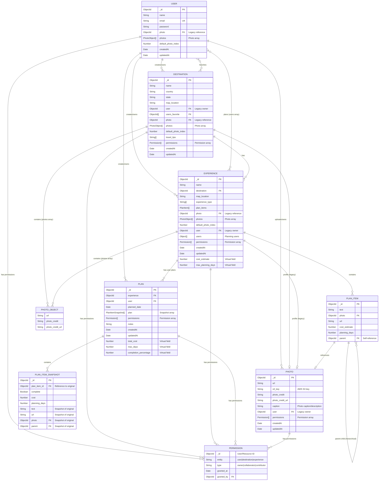
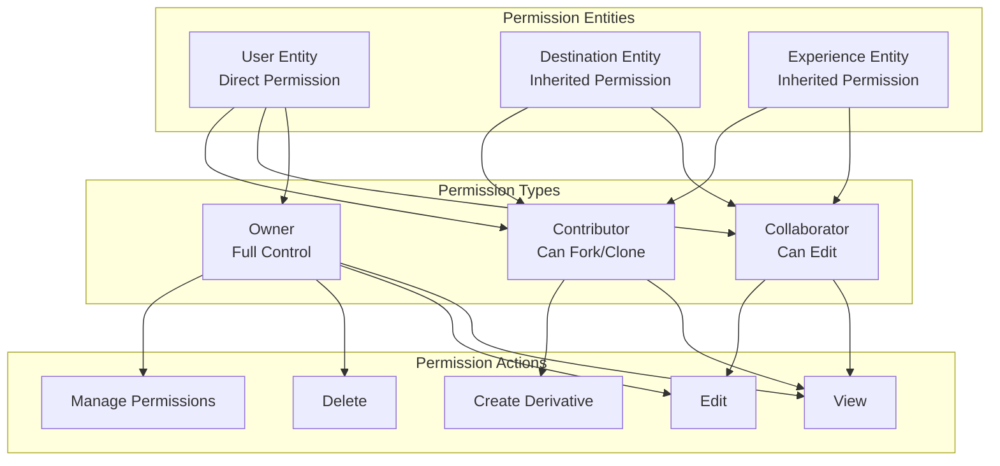
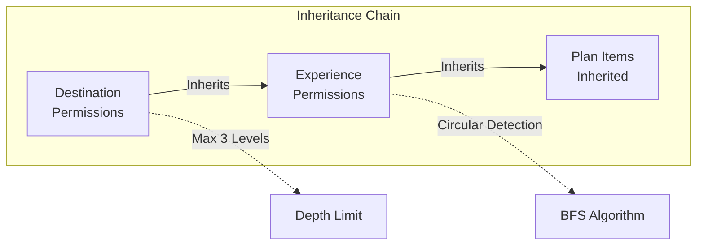
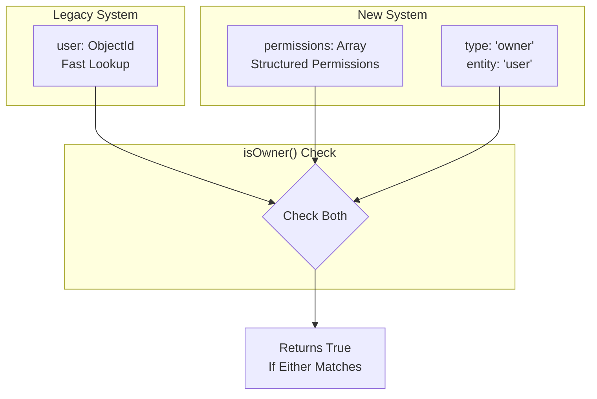
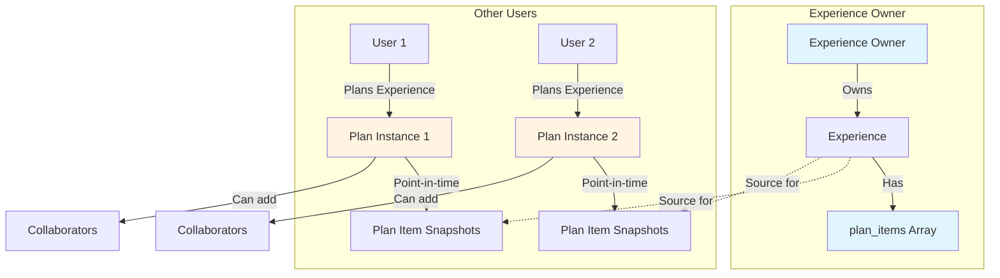
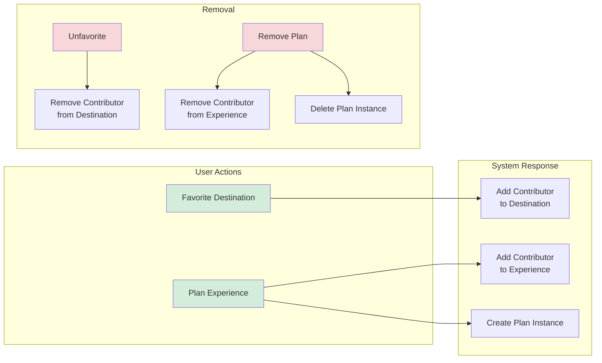
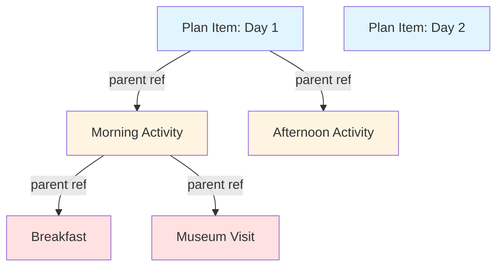
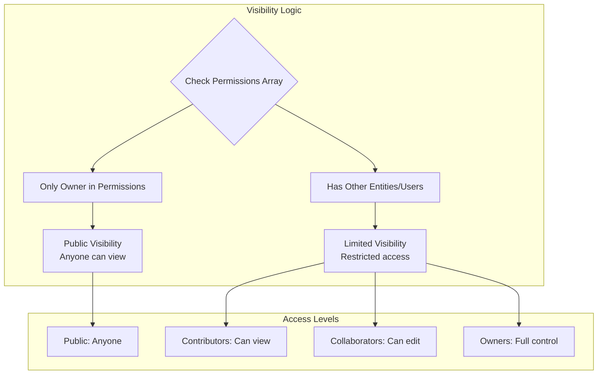

# Biensperience Data Model

This document provides a comprehensive overview of the Biensperience data model, including all entities, relationships, and the permissions framework.

## Entity Relationship Diagram



## Permissions Framework

### Permission Schema

All resources (Destinations, Experiences, Photos) implement a permissions array that enables collaborative content creation and role-based access control.



### Permission Inheritance Flow



### Dual Ownership Model (Backwards Compatible)



## Key Relationships

### Plan Model and User Planning



**Key Points:**

- **Experience Owners**: Keep plan items directly on Experience model, no separate Plan instance
- **Other Users**: Get individual Plan instances with snapshots when they "plan" an experience
- **Point-in-Time**: Plan snapshots preserve original state even if experience changes
- **Collaboration**: Plan owners can add collaborators to work together on their plan
- **Collaborator Display**: At top of Plan Items: "Collaborators: A, B, C, and D" with profile links
- **Automatic Creation**: Plans created when user clicks "Plan Experience"
- **Automatic Deletion**: Plans deleted when user removes plan from experience
- **Deletion Protection**: Experiences cannot be deleted if other users have plans for them
- **Contributor Status**: Users become contributors to the experience when they create a plan

### Automatic Contributor Assignment



**Rules:**

- Favoriting a destination → adds user as contributor (unless owner/collaborator)
- Planning an experience → adds user as contributor + creates Plan instance
- Unfavoriting → removes contributor permission (if not owner/collaborator)
- Unplanning → removes contributor permission + deletes Plan instance
- Owner/Collaborator status protects from auto-removal

### User to Experience Planning

```mermaid
graph LR
    U[User]
    E[Experience]
    
    U -->|Creates| E
    U -->|Plans| E
    
    subgraph "Experience.users Array"
        PLAN[user: ObjectId<br/>plan: String[]<br/>planned_date: Date]
    end
    
    E --> PLAN
```

### Hierarchical Plan Items



### Photo Storage Strategy

```mermaid
graph TB
    subgraph "Photo Model"
        PM[Photo Document]
        URL[url: String]
        S3[s3_key: String]
        CRED[photo_credit: String]
    end
    
    subgraph "Photo Object (Embedded)"
        PO[PhotoObject in Array]
        URL2[url: String]
        CRED2[photo_credit: String]
    end
    
    subgraph "Storage"
        AWS[AWS S3<br/>Uploaded Images]
        EXT[External URLs<br/>Unsplash, etc.]
    end
    
    AWS -->|s3_key set| PM
    EXT -->|s3_key null| PM
    
    PM -->|Legacy| DEST_PHOTO[destination.photo]
    PM -->|Legacy| EXP_PHOTO[experience.photo]
    PM -->|Reference| PLAN_PHOTO[plan_item.photo]
    
    PO -->|Current| DEST_PHOTOS[destination.photos[]]
    PO -->|Current| EXP_PHOTOS[experience.photos[]]
    PO -->|Current| USER_PHOTOS[user.photos[]]
```

### Photo Visibility Rules

Photos implement a permission-based visibility system that controls who can view and interact with them:



**Visibility Rules:**

- **Public Photo**: Permissions array contains only the owner
  - Anyone can view the photo
  - Only owner can edit or delete
  
- **Limited Visibility Photo**: Permissions array contains owner plus other entities/users
  - Only listed users/entities can view
  - Contributors can view only
  - Collaborators can view and edit (but not delete or manage permissions)
  - Owners have full control (view, edit, delete, manage permissions)

**Examples:**

```javascript
// Public photo - only owner in permissions
{
  permissions: [
    { _id: userId, entity: 'user', type: 'owner' }
  ]
  // Anyone can view this photo
}

// Limited visibility photo - has additional permissions
{
  permissions: [
    { _id: userId, entity: 'user', type: 'owner' },
    { _id: collaboratorId, entity: 'user', type: 'collaborator' },
    { _id: destinationId, entity: 'destination' }
  ]
  // Only owner, collaborator, and users with destination access can view
}
```

## Data Model Features

### Dual Photo System

- **Legacy**: Single `photo` field (ObjectId reference)
- **Current**: `photos` array (embedded PhotoObjects) with `default_photo_index`
- Maintains backwards compatibility during migration

### Permission System

- **Owner**: Full control (edit, delete, manage permissions)
- **Collaborator**: Can edit content, cannot manage permissions
- **Contributor**: Can view and create derivatives (fork/clone)
- **Inheritance**: Permissions flow from Destination → Experience (max 3 levels)
- **Circular Prevention**: BFS algorithm detects and prevents cycles

### Virtual Fields

- **Experience.cost_estimate**: Calculated sum of all plan item costs
- **Experience.max_planning_days**: Maximum planning days across plan items
- Both recursively calculate through hierarchical plan items

### Security Features

- Password hashing with bcrypt (6 rounds)
- JWT token authentication
- Permission validation on all mutations
- Duplicate permission prevention
- Owner requirement enforcement

## Schema Validation Rules

### Permissions Array

1. Must have at least one owner (for user entities)
2. No duplicate permissions (same entity + _id)
3. User entities must have type specified
4. Resource entities (destination/experience) can omit type

### Photo References

- S3-hosted photos: Must have `s3_key`
- External URLs: Should NOT have `s3_key`
- All photos require `user` field (owner)
- Photos support optional `caption` field for descriptions
- **Visibility**: Empty permissions (only owner) = public; additional permissions = limited visibility
- Contributors can view limited photos; collaborators can edit them

### Plan Items

- Can have parent reference (hierarchical)
- Root items have no parent
- Supports nested cost and planning day calculations

## API Endpoints for Permissions

Each resource type (Destination, Experience, Photo) supports:

- `POST /api/:resource/:id/permissions/collaborator` - Add collaborator
- `DELETE /api/:resource/:id/permissions/collaborator/:userId` - Remove collaborator
- `POST /api/:resource/:id/permissions/contributor` - Add contributor
- `DELETE /api/:resource/:id/permissions/contributor/:userId` - Remove contributor

All permission endpoints require:

- Authentication (JWT)
- Owner validation
- ObjectId validation
- Duplicate prevention

## Component Architecture

### User Display Components

The platform implements a composable component architecture for displaying user information, following data model naming conventions: `{DataModel}{Action}{ComponentType}`.

#### UserAvatar (Atomic Component)

**Purpose**: Displays a single user's avatar with flexible photo URL handling.

**Location**: `src/components/UserAvatar/UserAvatar.jsx`

**Props**:
```javascript
{
  user: User,           // User object with photo data
  size: String,         // 'sm' (32px), 'md' (40px), 'lg' (48px), 'xl' (64px)
  className: String,    // Optional CSS classes
  style: Object        // Optional inline styles
}
```

**Photo URL Resolution**: The component implements a `getPhotoUrl()` helper that handles multiple photo formats:

1. **Direct URL string**: Returns the string
2. **Photo object with url property**: Returns `photo.url`
3. **Photos array with default_photo_index**: Returns `photos[default_photo_index].url`
4. **Fallback**: Returns empty string (uses alt text initials)

**Routing**: Clicking avatar navigates to `/profile/${user._id}`

**Example Usage**:
```jsx
<UserAvatar user={owner} size="md" />
<UserAvatar user={collaborator} size="sm" className="ms-2" />
```

#### UsersListDisplay (Composite Component)

**Purpose**: Displays a list of users with overlapping avatars and smart single-user display.

**Location**: `src/components/UsersListDisplay/UsersListDisplay.jsx`

**Props**:
```javascript
{
  users: User[],       // Array of user objects
  messageKey: String,  // i18n key for context message
  size: String        // Avatar size to use
}
```

**Features**:

- **Overlapping Stack**: Uses negative margin (-12px) for visual overlap
- **Smart Single Display**: When only one user (owner), shows avatar without "+1" badge
- **Context Message**: Displays message from `lang.constants.js` via `messageKey`
- **Mobile Responsive**: Centers display on screens < 992px wide

**Example Usage**:
```jsx
<UsersListDisplay 
  users={[owner, ...collaborators]} 
  messageKey="collaborators"
  size="md"
/>
```

### Data Model Naming Convention

Components follow the pattern: `{DataModel}{Action}{ComponentType}`

- **UserAvatar**: `User` + (implicit Show) + `Avatar`
- **UsersListDisplay**: `Users` + `List` + `Display`

This ensures component names directly reflect the data models they represent, improving code discoverability and maintainability.

## Photo Handling Patterns

### Photo URL Extraction Helper

The `getPhotoUrl()` helper function standardizes photo URL extraction across multiple formats:

```javascript
const getPhotoUrl = (user) => {
  if (!user?.photo) return '';
  
  // Handle direct URL string
  if (typeof user.photo === 'string') return user.photo;
  
  // Handle photo object with url property
  if (user.photo.url) return user.photo.url;
  
  // Handle photos array with default_photo_index
  if (user.photos?.length > 0) {
    const defaultIndex = user.default_photo_index || 0;
    return user.photos[defaultIndex]?.url || '';
  }
  
  return '';
};
```

**Supported Formats**:

1. **Legacy Photo Field**: `user.photo` as ObjectId populated to Photo document
2. **Photo Object**: `user.photo` as object with `url` property
3. **Photos Array**: `user.photos[default_photo_index]` with PhotoObject structure

### API Photo Population Pattern

When returning user data with photo information, APIs must properly populate nested photo references. This is especially important for permissions arrays that contain user objects.

#### Manual Population for Nested References

**Pattern**: Use manual population when `populate()` doesn't reach nested arrays:

```javascript
// Example from experiences.js - showExperience()
if (experience.permissions) {
  for (let i = 0; i < experience.permissions.length; i++) {
    const perm = experience.permissions[i];
    if (perm.entity === 'user' && perm._id) {
      // Check if photo is an ObjectId/string (not already populated)
      if (typeof perm._id.photo === 'string' || 
          perm._id.photo instanceof mongoose.Types.ObjectId) {
        // Manually populate the photo field
        const userWithPhoto = await User.findById(perm._id._id)
          .populate('photo')
          .select('name email photo photos default_photo_index');
        
        if (userWithPhoto) {
          experience.permissions[i]._id = userWithPhoto;
        }
      }
    }
  }
}
```

#### Nested Populate for Direct References

**Pattern**: Use nested `populate()` for direct references:

```javascript
// Example from plans.js - getUserPlans()
const plans = await Plan.find({ 'users.user': req.user._id })
  .populate({
    path: 'users.user',
    select: 'name email photo photos default_photo_index',
    populate: {
      path: 'photo',
      model: 'Photo'
    }
  })
  .populate({
    path: 'permissions._id',
    select: 'name email photo photos default_photo_index',
    populate: {
      path: 'photo',
      model: 'Photo'
    }
  });
```

#### Photo Field Selection

**Always include both photo systems** when selecting user fields:

```javascript
.select('name email photo photos default_photo_index')
```

This ensures compatibility with:
- Legacy `photo` field (ObjectId reference)
- Current `photos` array (embedded PhotoObjects)
- `default_photo_index` for selecting primary photo

#### API Locations with Photo Population

Photo population is implemented in the following API endpoints:

**Experiences API** (`controllers/api/experiences.js`):
1. `showExperience()` - Manual population for permissions array

**Plans API** (`controllers/api/plans.js`):
1. `getUserPlans()` - Nested populate for users and permissions
2. `getPlanById()` - Nested populate for users and permissions
3. `getExperiencePlans()` - Nested populate for users and permissions
4. `createPlan()` - Nested populate for users and permissions
5. `updatePlan()` - Two locations with nested populate

### Photo Storage and S3 Keys

**Rule**: Only S3-hosted photos should have `s3_key` field set.

- **S3-hosted**: Photo uploaded to AWS S3 bucket → has `s3_key`
- **External URL**: Photo from Unsplash, direct URL → NO `s3_key`

This distinction is important for:
- Deletion logic (only delete from S3 if `s3_key` exists)
- Storage accounting and cleanup
- Migration from external to hosted photos

## S3 CORS Configuration

### CORS Policy Structure

AWS S3 CORS policies must use the `CORSRules` wrapper structure:

```json
{
  "CORSRules": [
    {
      "AllowedOrigins": [
        "http://localhost:3000",
        "https://biensperience.com"
      ],
      "AllowedMethods": ["GET", "HEAD"],
      "AllowedHeaders": ["*"],
      "MaxAgeSeconds": 3000
    }
  ]
}
```

**File**: `s3-cors-policy.json` in project root

**Common Mistake**: Providing array directly without `CORSRules` wrapper will fail AWS CLI validation.

### CORS Update Script

**File**: `update-s3-cors.sh`

**Features**:
- Reads `BUCKET_NAME` from `.env` or `.env.local`
- Uses absolute path resolution for policy file
- Proper AWS CLI output format configuration

**Usage**:
```bash
./update-s3-cors.sh
```

**Environment Variables Required**:
- `BUCKET_NAME`: S3 bucket name (e.g., 'biensperience-photos')
- AWS credentials must be configured via AWS CLI

**Troubleshooting**: See `documentation/S3_CORS_FIX.md` for detailed guide (400+ lines).

## Cookie Management

### Sync Alert Dismissal

The platform uses cookies to track user dismissal of sync alerts with 7-day expiration.

**Cookie Pattern**: `{feature}_{entityId}`

**Example**:
```javascript
// Cookie name for plan sync alert
const cookieName = `planSyncAlertDismissed_${planId}`;

// Cookie expiration
const SYNC_ALERT_DURATION = 7 * 24 * 60 * 60 * 1000; // 1 week in milliseconds

// Set cookie
document.cookie = `${cookieName}=true; max-age=${SYNC_ALERT_DURATION / 1000}; path=/`;
```

**Implementation**: `src/views/SingleExperience/SingleExperience.jsx`

**Features**:
- Dismissal persists for 7 days
- Separate tracking per plan (using plan ID)
- Automatic expiration handling
- Path-scoped to root

**UI Behavior**:
- Close button (X) dismisses alert for 7 days
- Sync Now button always visible (not affected by dismissal)
- Alert reappears after 7 days if sync still needed

## Layout Patterns

### My Plan Tab Organization

The My Plan view follows a consistent top-to-bottom layout structure:

```
┌─────────────────────────────────────┐
│  Sync Alert Area (dismissible)      │
│  ├─ Warning message                 │
│  └─ "Sync Now" button + Close (X)   │
├─────────────────────────────────────┤
│  Collaborators Display               │
│  ├─ UsersListDisplay component      │
│  └─ "Collaborators: A, B, C, and D" │
├─────────────────────────────────────┤
│  Action Buttons Row                  │
│  ├─ "Sync Now" (always visible)     │
│  ├─ "Add Collaborators"             │
│  └─ "Set Planned Date"              │
├─────────────────────────────────────┤
│  Plan Items Content                  │
│  └─ Hierarchical checklist          │
└─────────────────────────────────────┘
```

**Key Features**:

1. **Alert Area at Top**: Sync alerts appear at top with high z-index (10)
2. **Persistent Sync Button**: Appears in both alert and action buttons
3. **Collaborators First**: Shows who has access to the plan
4. **Action Buttons Together**: All plan management actions in one row
5. **Mobile Responsive**: Components center on screens < 992px

**Implementation**: `src/views/SingleExperience/SingleExperience.jsx`

### Planned Date Empty State

When a plan has no planned date set, the display shows an actionable link:

**Text**: "Not set. Set One Now"

**Behavior**:
- Clicking "Set One Now" opens the date modal
- Link scrolls to view if needed
- Modal allows setting future planned date
- Updates immediately upon save

**Language Constant**: `setOneNow: "Set One Now"` in `src/lang.constants.js`
